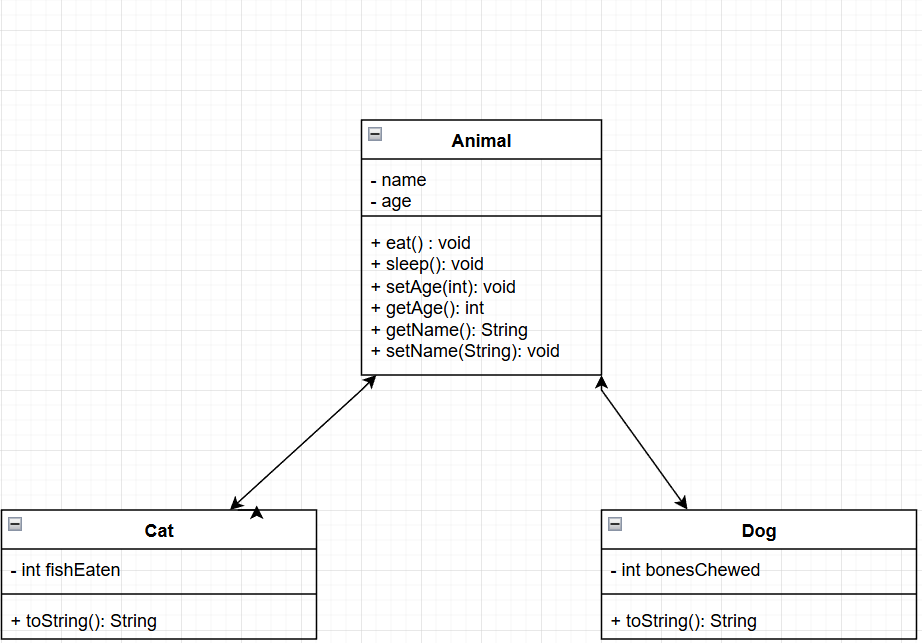
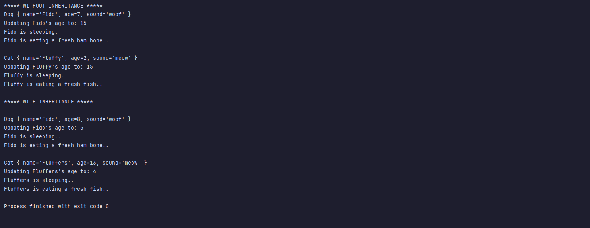

# The Evolution of Code: Exploring Java Inheritance for Better Design.

[Read on Medium](https://medium.com/@rileyxq/java-singular-inheritance-57aa5703cb18) | [Read on LinkedIn](https://www.linkedin.com/pulse/evolution-code-exploring-java-inheritance-better-design-shenefelt-lwuac/?trackingId=rzXW1vqOSSyaebJeyf%2BNTg%3D%3D)
| [Email Me](mailto:rileyxq@rxquinn.net)
---

Understanding inheritance can be one of the most challenging concepts for new programmers. Many find it difficult to
grasp not only how inheritance works but also when it’s appropriate to use it in their code.

In this article, I’ll explore key patterns and scenarios that indicate when to abstract common functionality and create
child classes.
By recognizing these patterns, you’ll be equipped to leverage inheritance effectively, leading to cleaner,
more scalable code. Let’s dive in and uncover the power of inheritance together!

# Bad Class Designs: Too Many Responsibilities, Not Enough Clarity

Consider these two classes:

```java
public class Cat {
    private String name;
    private int age;

    public Cat(String name, int age) {
        this.name = name;
        this.age = age;
    }

    public void eat() {
        System.out.println(name + " is eating a fresh fish..");
    }

    public void sleep() {
        System.out.println(name + " is sleeping..");
    }

    public void meow() {
        System.out.println(name + " says meow.");
    }

    public void setAge(int newAge) {
        System.out.println("Updating " + name + "'s age to: " + newAge);
        age = newAge;
    }

    public int getAge() {
        return age;
    }

    public boolean setName(String newName) {
        if (newName.isEmpty()) return false;
        name = newName;
        return true;
    }

    public String getName() {
        return name;
    }


    @Override
    public String toString() {
        return "Cat { " +
                "name='" + name + '\'' +
                ", age=" + age +
                ", sound='meow'" +
                " }";
    }

}
```

```java
public class Dog {

    private String name;
    private int age;

    public Dog(String name, int age) {
        this.name = name;
        this.age = age;
    }

    public void eat() {
        System.out.println(name + " is eating a fresh ham bone..");
    }

    public void sleep() {
        System.out.println(name + " is sleeping.");
    }

    public void bark() {
        System.out.println(name + " says woof.");
    }

    public void setAge(int newAge) {
        System.out.println("Updating " + name + "'s age to: " + newAge);
        age = newAge;
    }

    public int getAge() {
        return age;
    }

    public String getName() {
        return name;
    }


    public boolean setName(String newName) {
        if (newName.isEmpty()) return false;
        name = newName;
        return true;
    }


    @Override
    public String toString() {
        return "Dog { " +
                "name='" + name + '\'' +
                ", age=" + age +
                ", sound='woof'" +
                " }";
    }

}
```

When you compare these two these are the top two things that I notice right away:

* **Code Duplication:** Both classes repeat the same methods, leading to redundancy and making the code harder to
  maintain.

* **Scalability Problems:** If we wanted to add more animals (like birds), we'd have to duplicate those same common
  methods again, which would further increase complexity.

To solve this, we can leverage the power of **_"IS-A"_** relationships between objects—a classic design
principle that will streamline and simplify our code _(and life!)_.

---

# The Power of Inheritance: Clean, Smart Code

Let’s start with a few key benefits that inheritance provides:

* **Code Reusability:** Common methods are written once in the parent class and reused by its children.

* **Extensibility:** Classes can be extended to include unique methods or override parent class methods for customized
  behavior.

* **Consistent Interface:** Inheritance ensures that child classes maintain a predictable, easily understood interface,
  making
  the overall design more intuitive.

In the diagram,both **Cat** and **Dog** are types of **Animals**. The significant code duplication between them makes
this the
perfect opportunity to use inheritance. By introducing inheritance, we can not only clarify the relationship between
these objects but also simplify the child classes, making them cleaner and more concise.



---

# Unleashing the Power of the New Animal Class

In the code above, both the **Cat** and **Dog** classes share identical methods, except for their unique behaviors like
meow and
bark. This duplication is a clear sign that we're dealing with objects of a common type.

To eliminate redundancy, let’s create a parent class, Animal, to manage the shared methods. This will streamline our
code and make it more efficient.

```java

public class Animal {
    protected String name;
    protected int age;

    public Animal(String animalName, int animalAge) {

        name = animalName;
        age = animalAge;

    }

    public void eat() {
        System.out.println(name + " is eating..");
    }

    public void sleep() {
        System.out.println(name + " is sleeping..");
    }

    public void setAge(int newAge) {
        System.out.println("Updating " + name + "'s age to: " + newAge);
        age = newAge;
    }

    public int getAge() {
        return age;
    }

    public String getName() {
        return name;
    }

    public boolean setName(String newName) {
        if (newName.isEmpty()) return false;
        name = newName;
        return true;
    }
}
```

We could simply categorize all cats and dogs as generic **Animals** and pass a new field like **type** to differentiate
them.
However, clarity is key. Since cats and dogs have distinct methods—especially when it comes to their unique sounds—it’s
better to clearly define child classes. By doing so, we can implement custom methods for each, ensuring our design
remains both clean and understandable.

```java
public class ChildCat extends Animal {
    public ChildCat(String name, int age) {
        super(name, age); // call the Parents constructor to init fields.
    }


    @Override
    public void eat() {
        System.out.println(name + " is eating a fresh fish..");
    }

    @Override
    public String toString() {
        return "Cat { " +
                "name='" + name + '\'' +
                ", age=" + age +
                ", sound='meow'" +
                " }";
    }

}
```

```java
public class ChildDog extends Animal {

    public ChildDog(String name, int age) {

        super(name, age);
    }

    @Override
    public void eat() {
        System.out.println(name + " is eating a fresh ham bone..");
    }

    @Override
    public String toString() {
        return "Dog { " +
                "name='" + name + '\'' +
                ", age=" + age +
                ", sound='woof'" +
                " }";
    }


}
```

Ta-da! We now have clean, specialized child classes of the common Animal type. These classes are focused solely on the
behaviors unique to their specific animal.

Each animal makes a different sound and eats different foods, so the child classes override the parent methods to
customize them for each instance.

**_Did you know? All Objects in Java are a child of the Object class._** - This is where we get the toString() method
from.

---

# The Program Run

```java


public class Main {
    public static void main(String[] args) {

        System.out.println("***** WITHOUT INHERITANCE *****");
        Dog dog = new Dog("Fido", 7);
        Cat cat = new Cat("Fluffy", 2);

        System.out.println(dog);
        dog.setAge(15);
        dog.sleep();
        dog.eat();

        System.out.println();
        System.out.println(cat);
        cat.setAge(15);
        cat.sleep();
        cat.eat();


        System.out.println("\n***** WITH INHERITANCE *****");
        Animal cDog = new ChildDog("Fido", 8);
        Animal cCat = new ChildCat("Fluffers", 13);


        System.out.println();
        System.out.println(cDog);
        cDog.setAge(5); // method defined in Animal class
        cDog.sleep(); // method defined in Animal class
        cDog.eat(); // method defined in Animal class

        System.out.println();
        System.out.println(cCat);
        cCat.setAge(4); // method defined in Animal class
        cCat.sleep(); // method defined in Animal class
        cCat.eat(); // method defined in Animal class

    }
}


```

### The Output:



---

I hope this article has shed light on the importance of inheritance in programming and how it can lead to cleaner, more
scalable code. I’d love to hear your thoughts!

- **_Have you faced challenges with inheritance in your projects?_**
- **_Do you have tips or experiences to share?_**

